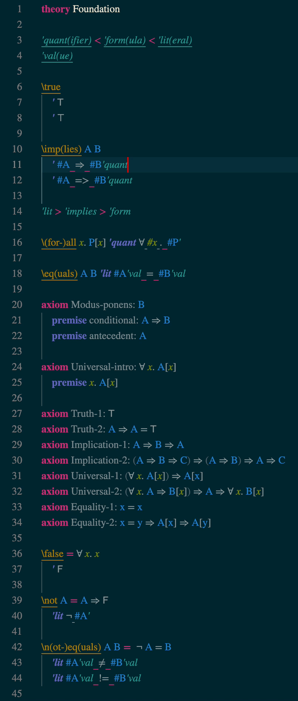

# Practal Core

## Installation

Practal Core is available as a [Visual Studio Code extension](https://marketplace.visualstudio.com/items?itemName=Practal.practal).
Make sure you also have the [STIX fonts](https://www.stixfonts.org) installed on your system.

## Features

You can describe an Abstraction Logic theory in a `.practal` file by:

* Declaring abstractions, and optionally defining them.
* Introducing axioms.
* Providing custom syntax for your abstractions. Practal Core contains under the hood a full engine for deterministic LR parsing. It is actually quite a lot of fun to play around with your own syntax!

The extension provides syntax highlighting for `.practal` files. 
Soon, you will be able to actually *do* something with your theory apart from admiring it, like computing and proving theorems, but for now, that's it. 

Please check [Practal.com](https://practal.com) for more information and updates!

## Known Issues

This is a very early version, not even alpha. 

* No proofs, or really any other features except the ones stated above.
* Works only on a single file, there is no possibility to import or include other theories. 